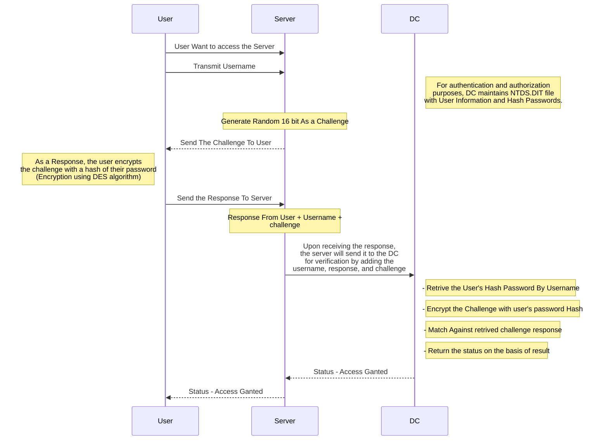

&nbsp;

## How NTLMv1 Work?

```mermaid
sequenceDiagram
    participant User
    participant Server
    participant DC
    User->>Server: User Want to access the Server
    User->>Server: Transmit Username
    Note right of DC: For authentication and authorization<br> purposes, DC maintains NTDS.DIT file <br>with User Information and Hash Passwords.
    Note over Server: Generate Random 16 bit As a Challenge
    Server-->>User: Send The Challenge To User
    Note left of User: As a Response, the user encrypts<br> the challenge with a hash of their password<br>(Encryption using DES algorithm)
    User->>Server: Send the Response To Server
    Note over Server: Response From User + Username + <br> challenge 
    Server->>DC: Upon receiving the response,<br>the server will send it to the DC <br>for verification by adding the <br>username, response, and challenge
    Note right of  DC : - Retrive the User's Hash Password By Username
    Note right of  DC : - Encrypt the Challenge with user's password Hash
    Note right of  DC : - Match Against retrived challenge response
    Note right of  DC : - Return the status on the basis of result
    DC-->>Server: Status - Access Ganted
    Server-->>User: Status - Access Ganted
```

